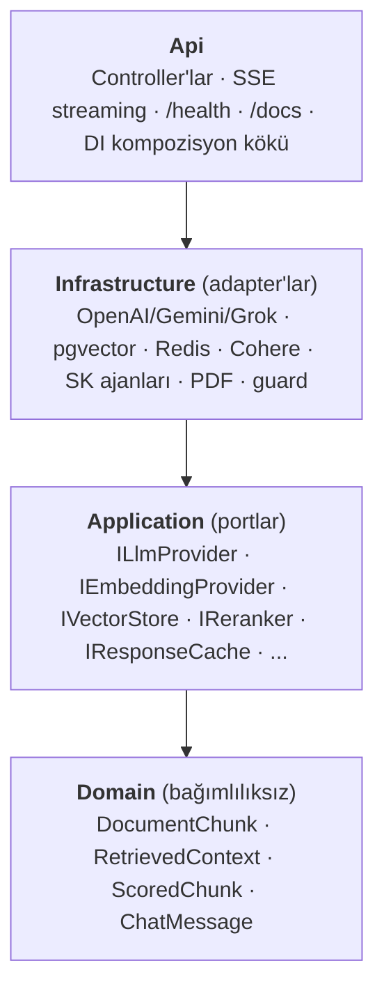
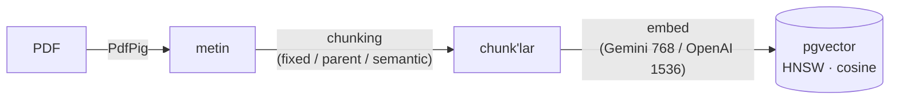
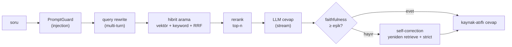

# Enterprise RAG + Agentic — Kurumsal Doküman Asistanı


Kurumsal PDF dokümanları üzerinde **kaynak-atıflı, halüsinasyona karşı denetimli** soru-cevap
sunan, **provider-agnostik** bir RAG (Retrieval Augmented Generation) + agentic sistem.
.NET 10 / ASP.NET Core · Clean Architecture · PostgreSQL + pgvector · Semantic Kernel.

**🔗 Canlı demo:** **[rag.ufukcetinkaya.com](https://rag.ufukcetinkaya.com)** — seed doküman yüklü,
hemen soru sorabilirsiniz. Arayüz her cevabın **retrieval/üretim süresini, faithfulness skorunu ve
aktif konfigürasyonu** canlı gösterir (observability paneli).

Kullanıcı bir PDF yükler → sistem metni chunk'lar, embed eder, pgvector'e yazar. Kullanıcı soru
sorar → **hibrit arama** (vektör + keyword + RRF) ilgili chunk'ları getirir, **rerank** eder,
context'e dayalı cevabı **stream** eder. Bir **faithfulness checker** cevabın gerçekten context'e
dayandığını denetler; düşükse **self-correction** devreye girer. Bir **prompt injection guard**
girdiyi işlemeden önce süzer.

---

## ✨ Öne çıkan özellikler

| Alan | Teknik |
|---|---|
| **Retrieval** | Hibrit arama (vektör + PostgreSQL full-text + **RRF** füzyon) · iki-aşamalı rerank (LLM / hibrit / **Cohere cross-encoder**) |
| **Chunking** | 3 strateji: sabit-boyut · **parent-document** (small-to-big) · **semantic** (anlam sınırları) — config-seçilebilir, eval ile kıyaslanmış |
| **Kalite / güven** | Faithfulness (groundedness) ölçümü · **retrieval-augmented self-correction** · kaynak atıfı (`[chunk:N]`) · prompt injection guard |
| **Provider-agnostik** | OpenAI · Gemini · Grok — tek port arkasında; **BYOK** (kullanıcı kendi anahtarı) + çoklu-anahtar rotasyonu (failover) |
| **Konuşma** | Multi-turn hafıza + **query rewriting** (takip soruları) |
| **Değerlendirme** | RAGAS-tarzı **eval harness**: Recall@k · MRR · answer accuracy · refusal · faithfulness |
| **Production** | Session izolasyonu · IP/token/session kotaları · TTL · Redis/Postgres cache · kill switch · SSE streaming · dayanıklılık (Polly) |
| **DevX** | **CI/CD** (GitHub Actions) · unit + **integration testler** (Testcontainers, gerçek pgvector) · **OpenAPI/Swagger** (`/docs`) · observability paneli |

> 📓 Her entegrasyonun "problem → çözüm → nasıl anlatılır" kaydı: [docs/YOL-HARITASI-VE-KATKILAR.md](docs/YOL-HARITASI-VE-KATKILAR.md)

---

## 📊 Değerlendirme — "ölçülmüş RAG"

Bu sistemin kalitesi **tahmin değil, ölçüm**. Yerleşik bir **eval harness** (RAGAS-tarzı) bir *altın
soru seti*ni (9 context-içi + 3 context-dışı) tüm hattan geçirip retrieval ve generation kalitesini
sayısallaştırır: **Recall@k**, **MRR**, **answer accuracy**, **refusal accuracy**, **faithfulness**.

Bu, iki şeyi mümkün kılar: (1) bir değişikliğin kaliteyi düşürüp düşürmediğini yakalamak
(regresyon kalkanı), (2) alternatifleri **veriyle** karşılaştırıp seçmek.

**Örnek: 3 chunking stratejisi, aynı belge, canlı ölçüm** — strateji seçimi tahminle değil, bu
kıyasla yapıldı. Ve önemli bir ders: **en iyi strateji belgeye bağlı değişir.**

**Uzun/çok-konulu belge (13 bölümlük İK politikası, 23 soru):**

| Strateji | Recall | MRR | Answer | Refusal | Faithfulness |
|---|---|---|---|---|---|
| **FixedSize** ✅ | %100 | 1.00 | **%100** | %100 | **1.00** |
| ParentDocument | %100 | 1.00 | %100 | %100 | 0.91 |
| Semantic | %100 | 1.00 | %84 | %100 | 1.00 |

Uzun belgede **FixedSize** en dengeli sonucu verdi (answer %100 + faithfulness 1.00). Semantic çok
sayıda küçük chunk üretince ilgili bilgi bölünüp **answer accuracy %84'e** düştü; ParentDocument'ın
büyük bağlamı ise faithfulness'ı hafif düşürdü (0.91).

**Kısa belge (tek sayfa) ise farklı kazananı işaret etmişti** — orada ParentDocument (faithfulness
1.00) öndeydi. Yani "en iyi chunking" evrensel değil: **ölçüp senaryoya göre seçmek gerekir.**
Buradaki asıl kazanım metriklerin yüksekliği değil, kararın **ölçülebilir/tekrarlanabilir** olması.
→ `GET /api/diagnostics/eval-suite`

---

## Mimari

**Clean Architecture — 4 katman.** Bağımlılık yönü içe doğru: `Api → Infrastructure → Application → Domain`.
Domain hiçbir şeye bağlı değildir; Application yalnızca **port** (interface) tanımlar, somut
**adapter**'lar Infrastructure'dadır. Bu, sağlayıcı değişimini tek bir katmanla sınırlar.



### Ingestion pipeline (`POST /api/documents`)



### Query pipeline (`POST /api/chat` · `GET /api/chat/stream`)



Agentic akış (diagnostics yolu) **RagOrchestrator** tarafından yürütülür: `retrieve → answer → check → (reflection)`.

---

## Teknoloji yığını

- **.NET 10**, ASP.NET Core Web API (C# 12+)
- **Microsoft.SemanticKernel** — agentic orkestrasyon (`IChatCompletionService`, plugin fonksiyonları)
- **PostgreSQL + pgvector** — vektör deposu, **HNSW** index + cosine + `to_tsvector` full-text (hibrit arama)
- **LLM sağlayıcıları** — Gemini (`gemini-flash-lite`, `gemini-embedding-001`@768), OpenAI (`gpt-4o-mini`, `text-embedding-3-small`@1536), Grok (OpenAI-uyumlu) — tek port arkasında, config/BYOK ile seçilir
- **Cohere Rerank** — cross-encoder yeniden sıralama (opsiyonel adapter)
- **Redis** (StackExchange.Redis) — opsiyonel dağıtık yanıt cache'i (Postgres alternatifi)
- **UglyToad.PdfPig** — PDF metin çıkarımı
- **Polly** — per-attempt timeout + geçici hata retry (dayanıklılık)
- **SSE** (Server-Sent Events) — token-token cevap akışı
- **OpenAPI / Scalar** — `/docs` self-dokümante API
- **Test:** xUnit (unit) + **Testcontainers** (gerçek pgvector'e karşı integration) · **GitHub Actions** CI

---

## Öne çıkan tasarım kararları

| Karar | Gerekçe |
|---|---|
| **Provider soyutlaması** (`ILlmProvider`, `IEmbeddingProvider`, `IVectorStore`) | LLM/embedding/vektör deposu port arkasında. OpenAI → Azure OpenAI (KVKK/TR bölgesi) veya on-prem Ollama geçişi **iş mantığına dokunmadan**, tek adapter değişimiyle. |
| **İki aşamalı retrieval** (top-k + rerank) | Cosine benzerliği tek başına yakın skorları ayıramıyor. `LlmReranker`, top-k=20 adayı **tek** LLM çağrısında 0–1 alaka puanlayıp top-n=4'e daraltır. İki dokümanlı çakışan senaryoda (çalışan "3 gün" vs stajyer "hak yok") doğru dokümanı öne çıkarır. |
| **Faithfulness checker + reflection loop** | Ayrı bir critic ajan, cevaptaki her iddianın context'te desteklenip desteklenmediğini 0–1 skorlar ve desteklenmeyen iddiaları listeler. Skor eşiğin altındaysa AnswerAgent bir kez "strict" modda yeniden üretir (generator-critic); yine düşükse cevaba şeffaf uyarı eklenir. Döngü 1 ile sınırlı. |
| **Prompt injection guard + yapısal ayrım** | `RuleBasedPromptGuard` üç kategoriyi (talimat ezme, rol/system sızdırma, delimiter kaçışı) TR+EN yakalar. Asıl güvence ise kullanıcı sorusunun system talimatından net delimiter'larla **ayrı bir `user` mesajında** tutulmasıdır — context'e gömülü komutlar talimat olarak yorumlanmaz. |
| **Graceful degradation** | Reranker bir *iyileştirme* katmanıdır; LLM hatası/bozuk JSON durumunda sessizce cosine sırasına düşer, retrieval'ı bloklamaz. Guard `Block`/`SanitizeAndWarn` modu, faithfulness `Enabled` bayrağı — hepsi config'ten. |
| **Konfigürasyon disiplini** | Model isimleri, chunk boyutu, top-k/n, faithfulness eşiği, guard davranışı, fiyatlandırma — hepsi `appsettings.json`'dan. Hard-code yok. Secret yalnızca `.env`'de. |

### Port → adapter eşlemesi

| Port | Bugünkü adapter(ler) | Yarın takılabilecek |
|---|---|---|
| `ILlmProvider` | `GeminiLlmProvider` · `OpenAiLlmProvider` (Grok dahil) | Azure OpenAI, Ollama |
| `IEmbeddingProvider` | `GeminiEmbeddingProvider` · `OpenAiEmbeddingProvider` | Azure, on-prem |
| `IVectorStore` | `PgVectorStore` (vektör + full-text) | Qdrant, Milvus, Azure AI Search |
| `IReranker` | `LlmReranker` · `HybridReranker` · `CohereReranker` | başka cross-encoder |
| `IResponseCache` | `PgResponseCache` · `RedisResponseCache` | başka dağıtık cache |
| `IApiKeyProvider` | `GeminiApiKeyProvider` (rotasyon + failover) | başka havuz stratejisi |
| `IPromptGuard` | `RuleBasedPromptGuard` | LLM-based classifier |
| `IFaithfulnessEvaluator` | `FaithfulnessCheckerAgent` (SK) | başka critic modeli |

---

## Nasıl çalıştırılır

**Gereksinimler:** .NET 10 SDK, Docker, bir Gemini **veya** OpenAI API anahtarı.

```bash
# 1) Secret'ları hazırla — .env.example placeholder içerir, gerçek key ASLA commit'lenmez
cp .env.example .env
#    .env içine GEMINI_API_KEY (varsayılan sağlayıcı) veya OPENAI_API_KEY yaz
#    (.env .gitignore'dadır)

# 2) pgvector'ı ayağa kaldır — extension + şema + HNSW index otomatik kurulur (db/init.sql)
docker compose up -d

# 3) API'yi çalıştır (startup'ta örnek seed doküman otomatik ingest edilir)
dotnet run --project src/KurumsalRAG.Api

# 4) Tarayıcıda demo arayüzü: http://localhost:5264/
#    (seed doküman yüklü — hemen soru sorabilirsiniz)
```

> Şema güncellendiyse (session_id kolonları, cache/usage tabloları) mevcut volume'ü sıfırlayın:
> `docker compose down -v && docker compose up -d`.

### Örnek istekler

```bash
# Doküman yükle
curl -X POST http://localhost:5264/api/documents \
     -F "file=@politika.pdf;type=application/pdf"

# Context-içi soru → kaynak-atıflı cevap
curl -X POST http://localhost:5264/api/chat \
     -H "Content-Type: application/json" \
     -d '{"question":"Çalışanlar haftada kaç gün uzaktan çalışabilir?"}'
# → "Çalışanlar haftada en fazla 3 (üç) gün uzaktan çalışabilir. [chunk:1]"

# Context-dışı soru → uydurmaz
curl -X POST http://localhost:5264/api/chat \
     -H "Content-Type: application/json" \
     -d '{"question":"Şirket araç tahsisi var mı?"}'
# → "Sağlanan dokümanlarda bu bilgi bulunmuyor."

# SSE ile token-token akış
curl -N "http://localhost:5264/api/chat/stream?question=Ev%20ofisi%20ekipman%20deste%C4%9Fi%20ne%20kadar%3F"
```

### Endpoint'ler

| Metot & yol | İş |
|---|---|
| `POST /api/documents` | PDF yükle → chunk + embed + store |
| `POST /api/chat` | Non-stream, kaynak-atıflı cevap + observability (BYOK header'ları destekler) |
| `GET  /api/chat/stream` | SSE, token-token cevap |
| `GET  /api/system/config` | Aktif konfigürasyon (observability paneli için) |
| `GET  /health` | DB + provider erişilebilirlik |
| `GET  /docs` | OpenAPI / Swagger arayüzü (Scalar) |
| `GET  /api/diagnostics/rerank` | Rerank öncesi/sonrası sıralama (yan yana) |
| `GET  /api/diagnostics/faithfulness` | Tam agentic akış + groundedness |
| `POST /api/diagnostics/faithfulness/check` | İzole checker (kurgulanan cevabı denetle) |
| `GET  /api/diagnostics/eval` | Tek yapılandırılmış eval kaydı (guard + chunk + faithfulness + token + maliyet) |
| `GET  /api/diagnostics/eval-suite` | Altın soru seti → Recall@k · MRR · answer accuracy · refusal · faithfulness |

> Diagnostics uçları `Demo:DiagnosticsEnabled=false` ile production'da **404** döner (LLM çağrısı yaparlar; dev/CI aracıdır).

### BYOK — kendi anahtarınla (herhangi sağlayıcı)

```bash
# Kullanıcı kendi Gemini/OpenAI/Grok anahtarını header'la verir → cevap onun modelinden,
# onun kotasından üretilir; demo limitine takılmaz. (Embedding/arama her zaman havuzdadır.)
curl -X POST http://localhost:8080/api/chat \
     -H "Content-Type: application/json" \
     -H "X-User-Ai-Provider: openai" \
     -H "X-User-Api-Key: sk-..." \
     -d '{"question":"Yıllık izin kaç gün?"}'
```

---

## Provider'ı değiştirme

**→ OpenAI / Gemini / Grok arası:** `appsettings`'te `Ai:Provider` (`Gemini`|`OpenAI`) tek satır —
iş mantığı değişmez. Kullanıcılar ayrıca `X-User-Ai-Provider` + `X-User-Api-Key` header'larıyla
kendi sağlayıcılarını (OpenAI/Gemini/Grok) **runtime'da** seçebilir (BYOK).

**→ Azure OpenAI (KVKK / TR bölgesi):** OpenAI adapter'ının `BaseUrl`'ünü Azure endpoint'ine çevir;
`KernelFactory`'de `AddAzureOpenAIChatCompletion`. İş mantığı değişmez.

**→ On-prem Ollama:** `ILlmProvider` / `IEmbeddingProvider` için Ollama adapter'ları yaz,
`DependencyInjection`'da kaydı değiştir. Embedding boyutu değişirse şema `vector(N)` boyutu
uygulama tarafında `EmbeddingDimensions`'tan otomatik gelir.

**→ Farklı vektör deposu / cache / reranker:** İlgili port arkasına yeni adapter, DI'da tek satır
(cache: Postgres↔Redis, reranker: LLM↔Hybrid↔Cohere — hepsi config-seçilebilir).

---

## Güvenlik yaklaşımı

- **Secret yönetimi.** API anahtarları yalnızca `.env` / ortam değişkeninde (`GEMINI_API_KEY(S)`,
  `OPENAI_API_KEY`, `COHERE_API_KEY`, `REDIS_CONNECTION`). `appsettings`'te anahtar yok; `.env`
  `.gitignore`'da. Gerçek anahtar hiçbir zaman commit'lenmez. BYOK anahtarı yalnızca istek
  scope'unda yaşar — body/log/cache'e girmez.
- **Prompt injection guard.** Kural tabanlı ilk katman (block / sanitize, config'ten). Asıl
  güvence: system/user içeriğinin yapısal ayrımı (context'e gömülü komut talimat sayılmaz).
- **On-prem / KVKK.** Provider soyutlaması sayesinde tüm LLM/embedding trafiği Azure'un TR
  bölgesine veya tamamen on-prem Ollama'ya taşınabilir — veri-ikameti senaryosu için hazır.
- **Groundedness denetimi.** Faithfulness checker hallucination'ı yakalar; düşük skorlu
  cevaplar reflection'a girer ya da uyarıyla işaretlenir.

---

## Production considerations (live demo)

Depo herkese açık, anonim bir canlı demo olarak yayımlanabilir. Aşağıdaki zırh, kötüye
kullanımı ve maliyeti sınırlarken Clean Architecture'ı bozmaz — her biri bir **port**
arkasında, davranış `appsettings` "Demo" bölümünden ayarlanır.

| Karar | Ne yapar | Gerekçe |
|---|---|---|
| **Session izolasyonu** | httpOnly cookie ile anonim session; her chunk `session_id` ile etiketlenir. Retrieval yalnızca kullanıcının kendi + `seed` chunk'larını görür. | Bir kullanıcının yüklediği doküman başka kullanıcıya sızmaz. Cookie httpOnly (XSS'e karşı JS erişemez). |
| **Seed doküman** | Startup'ta kurgusal bir şirket politikası PDF'i `session_id='seed'` ile ingest edilir. | Demo kullanıcısı hiçbir şey yüklemeden hemen soru sorabilir. |
| **Doküman TTL** | Saatlik `BackgroundService`, seed hariç 24 saatten eski dokümanları siler. | Public demoda veri birikmesini ve kalıcı depolama yükünü önler. |
| **Günlük token bütçesi** | `daily_usage` tablosunda restart-dayanıklı sayaç. Aşımda LLM çağrılmaz; nazik "limited" cevabı. | OpenAI maliyet tavanı — kötüye kullanım faturayı patlatamaz. |
| **Kill switch** | `Demo:Enabled=false` → tüm chat uçları "limited" döner. | Sorun anında tek konfigürasyonla üretimi durdurma. |
| **IP kotaları** | .NET yerleşik rate limiting: IP başına günlük sorgu (30) ve upload (3). `ForwardedHeaders` ile Nginx arkasında gerçek IP. | Tek bir IP'nin servisi tüketmesini engeller. |
| **Session kotaları** | Session başına en fazla 2 doküman, toplam 20 MB. | Depolama ve embedding maliyetini kullanıcı başına sınırlar. |
| **Yanıt cache'i** | `(session + normalize soru)` anahtarı, DB tablosu, TTL 24s. Hit'te LLM'e gidilmez; cevap `cached` işaretlenir. | Tekrarlı sorularda gecikmeyi ve maliyeti düşürür. |
| **Upload sertleştirme** | `application/pdf` + magic-byte (`%PDF-`), 10 MB, 50 sayfa sınırı. | Sahte/zararlı dosya ve kaynak tüketimini engeller. |
| **Global hata yönetimi** | `IExceptionHandler` + ProblemDetails; stack trace kullanıcıya sızmaz. | Bilgi sızıntısını önler, kullanıcı-dostu mesaj verir. |

**Yeni portlar (Application) → adapter (Infrastructure):** `ISessionAccessor` → `HttpSessionAccessor`
(Api), `IResponseCache` → `PgResponseCache`, `ITokenBudgetGuard` → `PgTokenBudgetStore`,
`ISessionQuota` → `PgSessionQuota`. Cache'i Redis'e taşımak = tek adapter değişikliği.

**Yapılandırma (`appsettings.json` → `Demo`):**

```jsonc
"Demo": {
  "Enabled": true,              // kill switch
  "SeedSessionId": "seed",
  "DailyTokenBudget": 200000,   // günlük global token tavanı
  "DocumentTtlHours": 24,
  "Ip":      { "QueriesPerDay": 30, "UploadsPerDay": 3 },
  "Session": { "MaxDocuments": 2, "MaxTotalBytes": 20971520 },
  "Cache":   { "TtlHours": 24 },
  "Upload":  { "MaxBytes": 10485760, "MaxPages": 50 }
}
```

**Bilinen sınırlamalar:** Rate limiter penceresi süreç-içi (in-memory) tutulur; süreç
yeniden başlarsa IP pencereleri sıfırlanır (token bütçesi ise DB'de kalıcıdır). Token/maliyet
tahmini stream yolunda karakter-tabanlı kestirimdir (SK usage döndürmez); non-stream yolda
gerçek OpenAI usage kullanılır. Session anonim cookie tabanlıdır; cookie silinirse yeni session
başlar (kimlik doğrulama yoktur — demo amaçlıdır).

---

## Deployment (rag.ufukcetinkaya.com)

Hedef: Ubuntu + Nginx (üzerinde **başka siteler de barınıyor** — bu kurulum onlara
dokunmaz; `rag.ufukcetinkaya.com` için **ayrı** bir Nginx server bloğu ekler).

**Mimari:** İnternet → Nginx (443, TLS) → `127.0.0.1:8092` (Docker: API) → `postgres` (Docker, dışarı kapalı).

### Ön koşullar
- Sunucuda Docker + Docker Compose, Nginx, certbot (`sudo apt install certbot`).
- **DNS:** `rag.ufukcetinkaya.com` A kaydı sunucunun public IP'sine (bunu sen giriyorsun).
- Port **8092** sunucuda boş olmalı (aşağıda kontrol var). Doluysa: `.env.prod`'daki
  `API_PORT` + `deploy/nginx/rag.ufukcetinkaya.com.conf`'daki upstream portunu birlikte değiştir.

### Sunucuda çalıştırılacak komutlar (sırayla)

`deploy/server-deploy.sh` aşamalı ve **kendi kendini korur**: her nginx reload öncesi
`nginx -t` çalıştırır, BAŞARISIZ olursa yeni symlink'i siler ve durur — mevcut siteler
etkilenmez. Sertifika, iki conf ile alınır: önce sadece-80 (`rag.http-only.conf`) ile ACME,
sonra tam conf (80+443). Böylece ilk `nginx -t` sertifika referansı olmadan geçer.

```bash
# 0) Repoyu al
git clone https://github.com/UfukCetinkaya57/enterprise-rag-dotnet.git
cd enterprise-rag-dotnet

# 1) Ön kontrol: DNS, port 8092, mevcut nginx sağlığı, container'lar
sudo DOMAIN=rag.ufukcetinkaya.com bash deploy/server-deploy.sh preflight

# 2) Prod secret'ları hazırla — SADECE bu satırı sen doldur:
cp .env.prod.example .env.prod
nano .env.prod
#   OPENAI_API_KEY=sk-...            (gerçek OpenAI anahtarın)
#   POSTGRES_PASSWORD=...            (güçlü bir parola)
#   (.env.prod git-ignored — commit'lenmez)

# 3) Container: build + up + yerel health + dışarıdan erişilemezlik kontrolü
sudo DOMAIN=rag.ufukcetinkaya.com bash deploy/server-deploy.sh app

# 4) Nginx (yalnızca 80 + ACME) → nginx -t + reload (fail olursa symlink silinir + DUR)
sudo DOMAIN=rag.ufukcetinkaya.com bash deploy/server-deploy.sh nginx-http

# 5) TLS sertifikası (webroot; nginx'i durdurmaz, diğer siteleri etkilemez)
sudo DOMAIN=rag.ufukcetinkaya.com EMAIL=SENIN_EPOSTAN bash deploy/server-deploy.sh cert

# 6) Nginx (tam conf: 80→443 + TLS reverse proxy) → nginx -t + reload
sudo DOMAIN=rag.ufukcetinkaya.com bash deploy/server-deploy.sh nginx-tls

# 7) Smoke test (dışarıdan, TLS ile) → 6/6 geçmeli
sudo DOMAIN=rag.ufukcetinkaya.com bash deploy/server-deploy.sh smoke
```

> **certbot yaklaşımı:** `certonly --webroot` — certbot yalnızca sertifika alır, Nginx
> config'ine DOKUNMAZ; location/header'lar bizim kontrolümüzde kalır. `nginx-tls` aşaması
> ayrıca sertifika yenileme sonrası otomatik `systemctl reload nginx` hook'unu kurar.

### Sertifika yenileme
certbot paketi `certbot.timer`'ı otomatik kurar (günde 2 kez dener, süresi %30 kalınca yeniler).
Yenileme sonrası Nginx'in yeni sertifikayı alması için deploy hook:
```bash
echo 'systemctl reload nginx' | sudo tee /etc/letsencrypt/renewal-hooks/deploy/reload-nginx.sh
sudo chmod +x /etc/letsencrypt/renewal-hooks/deploy/reload-nginx.sh
sudo certbot renew --dry-run     # yenileme provasını doğrula
```

### Güncelleme (yeni sürüm çıktığında)
```bash
cd enterprise-rag-dotnet && git pull
docker compose -f docker-compose.prod.yml --env-file .env.prod up -d --build
# Şema DEĞİŞMEDİYSE volume korunur; değiştiyse "Bilinen riskler"e bak.
```

### Bilinen riskler ve rollback

| Risk | Etki / belirti | Önlem / geri alma |
|---|---|---|
| **Port 8092 dolu** | API başlamaz / başka servis kırılır | 1. adımdaki `ss` kontrolü; doluysa `.env.prod` + Nginx conf'ta portu değiştir |
| **DNS henüz yayılmadı** | certbot HTTP-01 başarısız | `dig +short` ile doğrula, yayılmayı bekle, certbot'u tekrarla |
| **Şema değişikliği** | Yeni sürümde tablo/kolon eklenirse eski volume uyumsuz olabilir | `init.sql` yalnızca boş volume'de çalışır. Gerekirse: `docker compose -f docker-compose.prod.yml --env-file .env.prod down -v` (demo verisi silinir, seed yeniden ingest edilir) → `up -d --build` |
| **Nginx conf hatası** | `nginx -t` fail / reload reddedilir | reload öncesi hep `nginx -t`. Bozulursa: `sudo rm /etc/nginx/sites-enabled/rag.ufukcetinkaya.com && sudo systemctl reload nginx` → **diğer siteler etkilenmeden** eski haline döner |
| **Kötü sürüm / hatalı deploy** | API 5xx | `git checkout <önceki-tag> && docker compose ... up -d --build`; ya da anlık durdurma: `docker compose -f docker-compose.prod.yml --env-file .env.prod stop api` |
| **Maliyet / kötüye kullanım** | Beklenmedik token harcaması | Anında kill switch: `.env.prod`'a `Demo__Enabled=false` ekle → `up -d` (tüm chat "limited" döner); günlük bütçe zaten `DailyTokenBudget` ile kaplı |

**Tam geri çekilme (demo'yu kaldır, diğer siteler kalsın):**
```bash
sudo rm -f /etc/nginx/sites-enabled/rag.ufukcetinkaya.com && sudo systemctl reload nginx
docker compose -f docker-compose.prod.yml --env-file .env.prod down    # -v eklemezsen veri kalır
```

### Doğrulanan güvenlik davranışları
- Diagnostics çift katman kapalı: uygulama (Production'da `DiagnosticsEnabled=false` → 404) **+** Nginx (`/api/diagnostics` → 404).
- `/health` sığ public; `/health?deep=true` yalnızca **loopback** (container içinden). Nginx'in arkasında dışarıdan deep çağrılamaz.
- Rate limiter **DB tabanlı** — API restart'ında sayaç sıfırlanmaz (doğrulandı: 1→2).
- Nginx `X-Forwarded-For` → API gerçek client IP'yi okur (doğrulandı: farklı IP'ler ayrı sayılır); `ForwardLimit=1` ile client XFF spoofing engellenir.

---

## Geliştirici notu — OneDrive

Depo `OneDrive\Desktop\RAG` altında. OneDrive senkronizasyonu ile git bazen `bin/`, `obj/`
gibi dizinlerde dosya kilidi çakışması yaşayabilir (bu dizinler zaten `.gitignore`'da). Bir
sorun görülürse OneDrive senkronunu kısa süreliğine duraklatmak yeterlidir; depoyu taşımak
zorunlu değildir.
